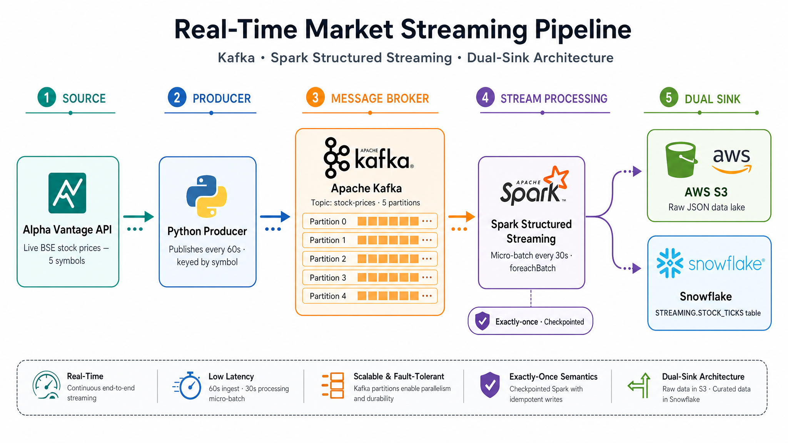

# Real-Time Market Streaming Pipeline

A production-grade real-time streaming pipeline ingesting live BSE stock data through Apache Kafka, processing it with Spark Structured Streaming, and landing it simultaneously in AWS S3 and Snowflake — all containerized with Docker.

## What This Pipeline Does

Every 60 seconds a Python producer fetches live closing prices for four large-cap BSE stocks and publishes them to Kafka — keyed by symbol so each stock always lands in its own partition. Spark Structured Streaming consumes these messages in 30-second micro-batches and writes to two sinks in the same processing step: raw JSON files land in AWS S3 as an immutable data lake, and structured records land in Snowflake's `STREAMING.STOCK_TICKS` table for real-time querying. The entire pipeline starts with one command.

## Architecture



## Stack

| Layer | Tool |
|-------|------|
| Data Source | Alpha Vantage API |
| Message Broker | Apache Kafka (4 partitions) |
| Stream Processing | Spark Structured Streaming |
| Data Lake | AWS S3 ap-south-1 |
| Data Warehouse | Snowflake |
| Orchestration | Docker Compose |

## Data Flow

Alpha Vantage API
↓
Python Producer — publishes every 60s, keyed by symbol
↓
Kafka: stock-prices topic (4 partitions — one per stock)
↓
Spark Structured Streaming — micro-batch every 30s
foreachBatch — dual-write in single processing step
↓                         ↓
AWS S3                       Snowflake
streaming/stock_prices/      STREAMING.STOCK_TICKS
Raw immutable JSON            Queryable structured rows

## Tracked Stocks

RELIANCE.BSE · TCS.BSE · HDFCBANK.BSE · INFY.BSE

## Project Structure
```
streaming-pipeline/
├── producer/
│   └── stock_producer.py      # Fetches API every 60s, publishes to Kafka
├── consumer/
│   └── spark_consumer.py      # Reads Kafka, writes to S3 + Snowflake via foreachBatch
├── kafka/
│   └── docker-compose.yaml    # Standalone Kafka + Zookeeper
├── Dockerfile.producer        # Producer container
├── Dockerfile.consumer        # Consumer container — Java 17 + PySpark 4.1.2
├── docker-compose.yaml        # Full pipeline: one command to start everything
├── requirements.txt
└── .env.example               # Required credentials (copy to .env)

## Quick Start

**Prerequisites:** Docker Desktop, credentials in `.env` (copy from `.env.example` and fill in all values)

```bash
git clone https://github.com/Samik7hos0/streaming-pipeline.git
cd streaming-pipeline
cp .env.example .env
# Fill in all credentials in .env
```

**Start the full pipeline (one command):**
```bash
docker compose up --build
```

Startup order is enforced automatically: Zookeeper → Kafka (health check) → init-kafka (creates topic) → producer + spark-consumer.

**Clean restart (wipes all state including Spark checkpoints):**
```bash
docker compose down -v
docker compose up --build
```

**Verify data flowing into Snowflake:**
```sql
SELECT SYMBOL, COUNT(*) AS RECORDS, MAX(PROCESSED_AT) AS LAST_PROCESSED
FROM DE_GRIND.STREAMING.STOCK_TICKS
GROUP BY SYMBOL ORDER BY SYMBOL;
```

## Key Engineering Decisions

**Kafka partitioning by symbol key**
The stock symbol is used as the Kafka message key. Kafka's default partitioner hashes the key to a partition — so RELIANCE always lands in Partition 0, TCS in Partition 1, and so on. This preserves per-symbol time-series ordering, which matters when downstream consumers need to process a stock's price history in sequence.

**foreachBatch — dual-sink in one processing step**
Rather than running two separate streaming queries (which would require two checkpoints and double the Kafka reads), `foreachBatch` calls a custom function once per micro-batch. That function writes to S3 and Snowflake in the same invocation. Each sink has its own try/except — if Snowflake is temporarily unavailable, S3 still receives the data.

**Exactly-once semantics via checkpointing**
After every successful batch, Spark writes the Kafka offset to a checkpoint directory. On restart, it reads the checkpoint and resumes from exactly the last committed offset — no data loss, no duplicates. This is the standard pattern for fault-tolerant streaming in production.

**Dual-sink data lakehouse pattern**
S3 stores raw immutable JSON — the source of truth that can be reprocessed at any time without re-hitting the API. Snowflake stores structured, queryable rows for analytics. This separation follows the data lakehouse architecture used by fintech DE teams at companies like Razorpay, CRED, and Groww.

**Production-grade Docker Compose startup ordering**
The compose file defines 5 services with strict dependency ordering. Zookeeper exposes a health check (nc port 2181); Kafka waits on it and exposes its own health check (nc port 9092). An `init-kafka` service then runs once to pre-create the `stock-prices` topic with 4 explicit partitions (`KAFKA_AUTO_CREATE_TOPICS_ENABLE: false`) and exits. The producer and spark-consumer only start after `init-kafka` completes successfully. Kafka uses dual listeners: `PLAINTEXT://kafka:9092` for internal Docker communication and `PLAINTEXT_HOST://localhost:29092` for external access. Spark checkpoints are persisted in a named Docker volume so they survive container restarts without polluting the project directory.

**Rate-limit aware producer**
Alpha Vantage's free tier allows 5 API calls per minute. The producer waits 13 seconds between each of the 4 stocks — completing one full cycle in ~52 seconds, safely under the limit. In production this would be replaced with a websocket feed or premium API tier for true real-time tick data.

## Known Issues / Gaps

**Resolved since initial commit**
- Kafka listener misconfiguration — now uses dual listeners (internal `kafka:9092` + external `localhost:29092`)
- Topic partition mismatch — topic is now explicitly pre-created with 4 partitions via `init-kafka`
- Stale checkpoints on restart — `docker compose down -v` clears the named volume cleanly

**Remaining**
- No unit or integration tests
- No monitoring or alerting
- `utils/snowflake_writer.py` is an empty placeholder — Snowflake write logic lives inline in `spark_consumer.py`

## Related Project

This pipeline is Part 2 of a two-project DE portfolio. [Project 1](https://github.com/Samik7hos0/market-pipeline) covers the batch ELT side — the same BSE stocks, daily schedule, dbt transformations, and Airflow orchestration. Together they demonstrate both paradigms of modern data engineering: batch and streaming, on the same domain.