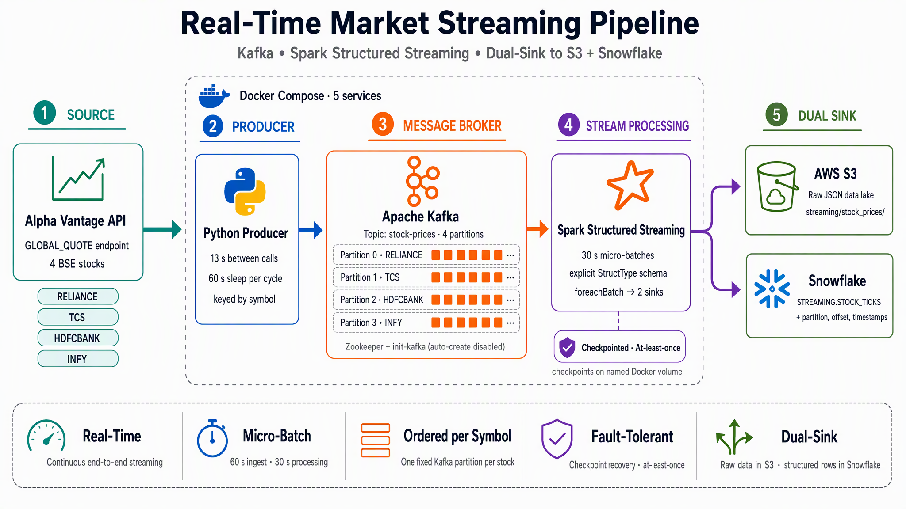

# Real-Time Market Streaming Pipeline

A production-grade real-time streaming pipeline ingesting live BSE stock data through Apache Kafka, processing it with Spark Structured Streaming, and landing it simultaneously in AWS S3 and Snowflake — all containerized with Docker.

## What This Pipeline Does

Every 60 seconds a Python producer fetches live closing prices for four large-cap BSE stocks and publishes them to Kafka — keyed by symbol so each stock always lands in its own partition. Spark Structured Streaming consumes these messages in 30-second micro-batches and writes to two sinks in the same processing step: raw JSON files land in AWS S3 as an immutable data lake, and structured records land in Snowflake's `STREAMING.STOCK_TICKS` table for real-time querying. The entire pipeline starts with one command.

## Architecture



## Stack

| Layer | Tool |
|-------|------|
| Data Source | Alpha Vantage API |
| Message Broker | Apache Kafka (4 partitions) |
| Stream Processing | Spark Structured Streaming |
| Data Lake | AWS S3 ap-south-1 |
| Data Warehouse | Snowflake |
| Orchestration | Docker Compose |

## Data Flow

Alpha Vantage API
↓
Python Producer — publishes every 60s, keyed by symbol
↓
Kafka: stock-prices topic (4 partitions — one per stock)
↓
Spark Structured Streaming — micro-batch every 30s
foreachBatch — dual-write in single processing step
↓                         ↓
AWS S3                       Snowflake
streaming/stock_prices/      STREAMING.STOCK_TICKS
Raw immutable JSON            Queryable structured rows

## Tracked Stocks

RELIANCE.BSE · TCS.BSE · HDFCBANK.BSE · INFY.BSE

## Project Structure
```
streaming-pipeline/
├── producer/
│   └── stock_producer.py      # Fetches API every 60s, publishes to Kafka
├── consumer/
│   └── spark_consumer.py      # Reads Kafka, writes to S3 + Snowflake via foreachBatch
├── kafka/
│   └── docker-compose.yaml    # Standalone Kafka + Zookeeper
├── Dockerfile.producer        # Producer container
├── Dockerfile.consumer        # Consumer container — JDK + PySpark 4.1.2
├── docker-compose.yaml        # Full pipeline: one command to start everything
├── requirements.txt
└── .env.example               # Required credentials (copy to .env)

## Quick Start

**Prerequisites:** Docker Desktop, credentials in `.env` (copy from `.env.example` and fill in all values)

```bash
git clone https://github.com/Samik7hos0/streaming-pipeline.git
cd streaming-pipeline
cp .env.example .env
# Fill in all credentials in .env
```

**Start the full pipeline (one command):**
```bash
docker compose up --build
```

Startup order is enforced automatically: Zookeeper → Kafka (health check) → init-kafka (creates topic) → producer + spark-consumer.

**Clean restart (wipes all state including Spark checkpoints):**
```bash
docker compose down -v
docker compose up --build
```

**Verify data flowing into Snowflake:**
```sql
SELECT SYMBOL, COUNT(*) AS RECORDS, MAX(PROCESSED_AT) AS LAST_PROCESSED
FROM DE_GRIND.STREAMING.STOCK_TICKS
GROUP BY SYMBOL ORDER BY SYMBOL;
```

## Key Engineering Decisions

**Kafka partitioning by symbol key**
The stock symbol is the Kafka message key, and the producer assigns each stock an explicit partition (RELIANCE → 0, TCS → 1, HDFCBANK → 2, INFY → 3). Every tick for a stock therefore lands in the same partition, preserving per-symbol time-series ordering for downstream consumers.

**foreachBatch — dual-sink in one processing step**
Rather than running two separate streaming queries (which would require two checkpoints and double the Kafka reads), `foreachBatch` calls a custom function once per micro-batch. That function writes to S3 and Snowflake in the same invocation. Each sink has its own try/except — if Snowflake is temporarily unavailable, S3 still receives the data.

**Restart recovery via checkpointing (at-least-once)**
Spark records the Kafka offsets it has processed in a checkpoint directory (persisted on a named Docker volume). On restart it resumes from the last committed offsets, so no data is lost. Delivery is at-least-once: both sinks append without deduplication, so a batch that fails midway can be written again on retry. Making it exactly-once would need idempotent writes (e.g. a MERGE keyed on symbol + timestamp in Snowflake).

**Dual-sink data lakehouse pattern**
S3 stores raw immutable JSON — the source of truth that can be reprocessed at any time without re-hitting the API. Snowflake stores structured, queryable rows for analytics. This separation follows the data lakehouse architecture used by fintech DE teams at companies like Razorpay, CRED, and Groww.

**Production-grade Docker Compose startup ordering**
The compose file defines 5 services with strict dependency ordering. Zookeeper exposes a health check (nc port 2181); Kafka waits on it and exposes its own health check (nc port 9092). An `init-kafka` service then runs once to pre-create the `stock-prices` topic with 4 explicit partitions (one per stock) (`KAFKA_AUTO_CREATE_TOPICS_ENABLE: false`) and exits. The producer and spark-consumer only start after `init-kafka` completes successfully. Kafka uses dual listeners: `PLAINTEXT://kafka:9092` for internal Docker communication and `PLAINTEXT_HOST://localhost:29092` for external access. Spark checkpoints are persisted in a named Docker volume so they survive container restarts without polluting the project directory.

**Rate-limit aware producer**
Alpha Vantage's free tier allows 5 API calls per minute. The producer waits 13 seconds between each of the 4 stocks, then sleeps 60 seconds, so one full cycle takes about 112 seconds, safely under the per-minute limit. In production this would be replaced with a websocket feed or premium API tier for true real-time tick data.

## Troubleshooting

Environment failures hit while getting the stack running, and how each was fixed. Each fix is visible in the current code.

| # | Area | Symptom | Cause | Fix |
|---|------|---------|-------|-----|
| 1 | Kafka networking | Producer container couldn't reach the broker | `KAFKA_BROKER` was hard-coded to `localhost:9092`, which inside a container points at the container itself | Read the broker from the `KAFKA_BROKER` env var; Compose sets it to `kafka:9092` |
| 2 | Kafka listeners | Clients inside Docker and on the host couldn't both connect | A single advertised listener can only be correct for one network | Dual listeners: `PLAINTEXT://kafka:9092` (internal) and `PLAINTEXT_HOST://localhost:29092` (host) |
| 3 | Topic partitions | Messages for a stock targeted a partition that didn't exist | The topic was auto-created with fewer partitions than the producer's fixed symbol → partition map | `init-kafka` pre-creates `stock-prices` with 4 partitions; broker auto-create is disabled |
| 4 | Checkpoint I/O | Consumer couldn't write checkpoints inside the container | The checkpoint path defaulted to a Windows path (`C:/tmp/...`) | Path comes from `SPARK_CHECKPOINT` (`/tmp/spark-checkpoints/...` in Docker) on a named volume |
| 5 | Checkpoint I/O | Stream failed to resume after the topic was recreated | Old checkpoints held offsets for a topic that no longer existed | `docker compose down -v` clears the checkpoint volume before a clean restart |
| 6 | Scala/JAR compatibility | Spark connectors failed to load | Spark 4.x is built on Scala 2.13, so every connector JAR must be a `_2.13` build matching the Spark version | Pinned `spark-sql-kafka-0-10_2.13:4.1.2` and `spark-snowflake_2.13:3.0.0` via `spark.jars.packages` |
| 7 | Hadoop-AWS (S3A) | Spark couldn't write to S3 | The S3A filesystem needs `hadoop-aws` plus a compatible AWS SDK bundle and explicit configuration | Pinned `hadoop-aws:3.4.1` with `aws-java-sdk-bundle`; set `fs.s3a.impl`, the regional endpoint, and numeric timeout/retry values |

## Run Evidence

Screenshots in [`docs/screenshots`](docs/screenshots), from the June 2026 runs:

- `S3 — bucket root (processedrawstreaming).png` and `S3 — streaming folder (checkpoints + stock_prices).png`: the data-lake layout in `de-grind-market-data-samik`.
- `S3 — streamingstock_prices (38 JSON files).png`: the JSON part files written by `foreachBatch`.
- `Snowflake — raw STOCK_TICKS 25 rows.png`: the latest rows in `STREAMING.STOCK_TICKS`, each with its Kafka partition (0–3) and offset.
- `Snowflake — STOCK_TICKS by symbol.png`: per-symbol record counts for RELIANCE, TCS, HDFCBANK and INFY.

## Known Issues / Gaps

Resolved issues are listed under [Troubleshooting](#troubleshooting).

**Remaining**
- No unit or integration tests
- No monitoring or alerting
- `utils/snowflake_writer.py` is an empty placeholder — Snowflake write logic lives inline in `spark_consumer.py`

## Related Project

This pipeline is Part 2 of a two-project DE portfolio. [Project 1](https://github.com/Samik7hos0/market-pipeline) covers the batch ELT side — the same BSE domain, daily schedule, dbt transformations, and Airflow orchestration. Together they demonstrate both paradigms of modern data engineering: batch and streaming, on the same domain.